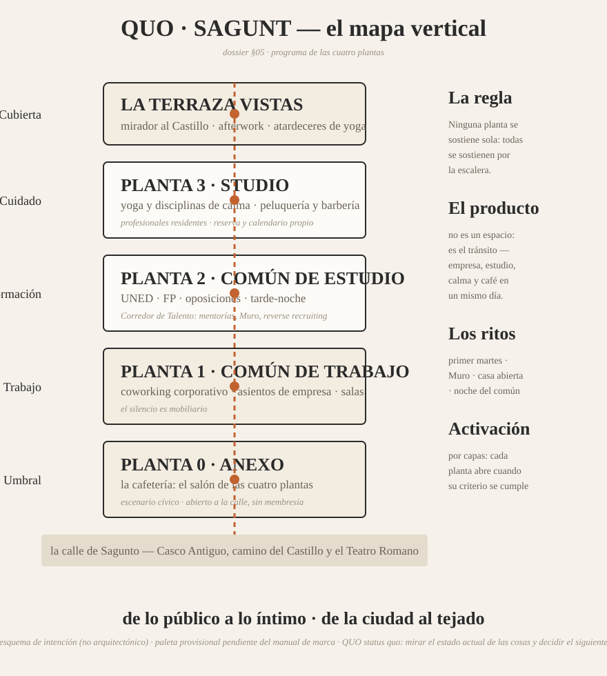

# QUO · Sagunt — Dossier de Presentación
### 05 · El programa: las cuatro plantas · v1.0 · ES

El programa de QUO sigue la lógica de la escalera: **de lo público a lo íntimo, de la ciudad al tejado.** Cada planta es un mundo completo con sus reglas; el hub es lo que ocurre entre ellas.

---

## Planta 0 · ANEXO — el umbral de la ciudad
*La cafetería, abierta a la calle, sin membresía necesaria.*

- **Qué es:** cafetería de día con criterio de especialidad — café de origen, cultura del mate, pastelería de la casa, opciones saludables sin alcohol — y mesa larga comunitaria junto al escaparate.
- **Qué hace por el hub:** es el **salón de recepción de las cuatro plantas**: allí se celebra la reunión rápida, se espera al candidato, se cierra el trato, se explica la idea al vecino. El miembro llega ANEXO antes de subir.
- **Relación con la ciudad:** escenario cívico en miniatura — catas abiertas, presentaciones de libros locales, exposiciones rotativas de artistas de la comarca en sus paredes. La planta 0 es el crédito público del proyecto.

## Planta 1 · Común de Trabajo
*El coworking corporativo: la planta que sostiene el día a día del hub.*

- **Qué es:** puesto flexible, puestos dedicados por empresa, cabinas de llamada, dos salas de reuniones reservables (una con equipo de videoconferencia "de presentación") y un pequeño despacho de privado para la entrevista incómoda.
- **Para quién:** equipos híbridos de las empresas del Camp de Morvedre bajo **asientos corporativos**; profesionales independientes con membresía; directivos de visita que necesitan una dirección, no un hotel.
- **Regla de la planta:** el silencio es mobiliario. Zonas acústicas, "reuniones en voz baja" y la norma no escrita de que una llamada se atiende en cabina, no en la mesa del vecino.

## Planta 2 · Común de Estudio
*La planta que forma a quien trabajará mañana en la planta 1.*

- **Qué es:** biblioteca viva con mesas de estudio, cabinas individuales, sala de trabajo en grupo con pizarra, horario extendido y tarde-noche.
- **Para quién:** estudiantado de la UNED Sagunto, de la FP comarcal, de idiomas, opositores y titulados que preparan su primer empleo. Membresía de estudio reducida en exigencia, idéntica en dignidad.
- **El puente:** el **Corredor de Talento** (ver §07) tiene aquí su escritorio: CV mural, "reverse recruiting", mentorías de miembros de la planta 1 a estudiantes de la 2. La planta 2 es la cantera moral y literal del hub.

## Planta 3 · Studio — bienestar y arreglo
*La planta que cuida a quienes producen.*

- **Qué es:** sala polivalente de **yoga, estiramientos, meditación y disciplinas afines** (pisos de madera, luz rasante, música propia), más los espacios de **peluquería y barbería** como *profesionales residentes* con programa propio.
- **Para quién:** toda la comunidad del hub y público exterior con reserva. Las clases de mañana temprano y mediodía para quienes bajan después a la ANEXO; el arreglo, antes de esa reunión que importa.
- **Por qué aquí arriba:** el bienestar necesita silencio y luz; la tercera planta del casco antiguo ofrece ambas cosas y vistas. La peluquería y la barbería comparten el criterio del hub: oficio serio, atmósfera de calma, sin espejos que griten.

## Cubierta · Terraza Vistas
*El tejado del común.*

- **Qué es:** terraza-mirador hacia el Castillo, con programa propio: yoga al atardecer, afterwork suave (sin alcohol, o con él — la regla es la elegancia, no la abstinencia), charlas de fin de curso, el brindis de los hitos del hub.
- **Qué hace:** la Terraza es el **premio visible** de pertenecer y la postal que la ciudad enseña. Un solo plano de Sagunto visto desde un lugar que hasta ayer era un trastero de muebles: esa imagen, por sí sola, cuenta el proyecto.

---

## La regla del programa

**Ninguna planta se sostiene sola como negocio aislado; todas se sostienen por la escalera.** La empresa baja a la ANEXO, el estudiante sube al yoga, el cliente de la barbería descubre la membresía de coworking. Ese tránsito vertical — medible en ascensor, invisible en la competencia — es el verdadero producto de QUO.

---
*Siguiente: [06 · Las personas — los miembros](06_Las-personas_los-miembros.md).*
